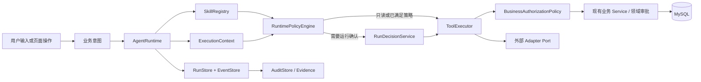

# 智慧食堂业务 Agent / Skill 运行时构建执行计划

> 版本：v1.1  
> 计划基线：2026-08-16  
> 项目范围：智慧食堂业务运行时  
> 当前状态：阶段 0～6 的首条运行时切片已落地，并新增了不占用外层事务的 claim-aware worker 执行入口、heartbeat 续租、带事务复核栅栏的 claim-aware stale-run 恢复和在 SQL LIMIT 前应用食堂白名单的默认关闭单实例轮询器；本轮已完成采购/库存/预警写 Skill 的运行时契约、统一工具适配和自然语言确认编排，但写入灰度仍默认关闭，生产灰度、多实例证据和敏感结果引用化仍是上线门禁。
> v1.1 修订说明：根据当前仓库代码、数据库迁移、契约和前端实现复核，调整依赖顺序、MVP 边界和验收门禁

> 2026-08-17 执行记录：新增一个受全局开关保护的规则型自然语言只读助手试点，用于验证会话持久化、澄清和 Agent Run 关联；它不改变阶段 3 的结构化意图门禁，也不代表自然语言入口已完成生产灰度。
> 2026-08-17 继续执行记录：在同一安全边界内新增 `menu.query` 只读 Skill、`MENU_READ` 权限和会话历史读取；菜单查询仍经 Agent Runtime 与 `DailyMenuService`，未开放菜单写操作。
> 2026-08-17 第三阶段执行记录：新增 V18 持久化澄清状态机和默认关闭的 `AssistantModelResolver` port；补充消息可恢复续问，但模型输出仍必须经过白名单校验，未接入真实外部模型或写操作。
> 2026-08-17 第四阶段执行记录：新增 `menu.publish` 自然语言预览—确认—取消编排；V19 持久化待处理 Run 计划，确认后仍复用现有运行时、授权策略、菜单审批、版本和幂等门禁；补充外部 Run 终态对账和高风险未支持意图前置拒绝，未开放采购/库存/预警写入。
> 2026-08-17 第五阶段执行记录：为助手 HTTP 入口增加“全局开关 + 食堂范围白名单”灰度门禁；配置缺失时 fail closed，关闭助手不影响原有页面路径，未因此扩大业务写入范围。
> 2026-08-17 第六阶段执行记录：新增按食堂范围聚合的 Agent 运行指标查询与前端看板，覆盖 Run 状态/成功率、确认等待、工具耗时、幂等重放、超时/对账和越权审计；指标不返回运行或用户标识，长期监控保留为上线门禁。
> 2026-08-17 MySQL 门禁执行记录：新增 `AgentRuntimeMySqlIntegrationTest`，由 `infra/verify-mysql-workflow.ps1` 与既有业务 Workflow 测试一起在隔离 MySQL 8 数据库中运行，覆盖 Agent 幂等并发、Step/Event/审计持久化、同键异载荷拒绝和 Spring 重启恢复；实测 MySQL 8.4.11、Flyway 11.20.3 通过，随机测试库已清理。
> 2026-08-17 Claim lease 执行记录：新增 V20 `agent_run_claims`、数据库 claim/续租/释放和 fencing seam；H2 与真实 MySQL 验收覆盖并发单领取、过期接管和旧 token 拒绝续租，完整 worker 调度与自动 stale-run recovery 当时仍未开启。
> 2026-08-18 Worker seam 执行记录：新增 `AgentRunWorker.claimAndExecute` 与 `AgentExecutionService.executeClaimed`；claim、工具调用、fenced Run/Step/Event 检查点和释放已拆成可独立提交的边界，worker 入口仍需由后续调度器/心跳驱动，未改变同步 HTTP/助手入口，也未开放采购/库存/预警写入。
> 2026-08-18 调度恢复执行记录：新增 worker heartbeat 自动续租、排除有效 claim 的 stale-run 扫描与带确定性幂等证据的 `RECONCILIATION_REQUIRED` 恢复，以及默认关闭且要求食堂白名单的单实例 `PLANNED` Run 轮询器；恢复器和调度器均要求 durable claim capability，异步入口仍需显式开关、唯一 owner-id 和生产灰度证据，未开放采购/库存/预警写入。
> 2026-08-18 MySQL 复验记录：重新执行 `infra/verify-mysql-workflow.ps1`，MySQL 8.4.11 / Flyway 11.20.3 在随机隔离库通过 V20 迁移、Agent 并发领取、过期接管、旧 token fencing 以及 active/expired/version recovery re-check，数据库已删除。
> 2026-08-18 写入 Skill 执行记录：新增 V21～V24 业务写权限/预警处置幂等、采购订单载荷哈希、采购/库存/预警 runtime manifest、`OperationsToolExecutor` 和 fail-closed 的 `agent.write` 开关/范围/意图白名单；自然语言入口支持显式参数澄清、可规划但默认不可执行的 `WAITING_CONFIRMATION` 计划、确认/取消与 Step 派生幂等键。采购订单必须从已确认计划转换并拒绝同键异载荷，手工入库写入批次/库存/溯源同一事务，预警处置要求精确食堂范围和持久化幂等；默认配置不开放任何写入。
> 2026-08-18 模型适配执行记录：新增 feature-flagged `DeepSeekAssistantModelResolver`，使用 OpenAI-compatible Chat Completions 接口；默认模型名为 `deepseek-v4-flash`，Key 仅从部署环境变量读取。模型只能补充只读意图或澄清，写入/审批仍由规则解析和后端门禁负责。

## 1. 目标与范围

本计划用于将智慧食堂中的真实业务 SOP 转化为可由 Agent 触发、判断、审批、执行和追溯的业务能力包，覆盖：

- 菜单编制、提交、审批和发布；
- 采购计划、采购单、供应商确认和收货；
- 食材批次、单位换算、库存预警和出库；
- 台账周期、记录完整性和风险提示；
- 预警接入、查询、处置和升级；
- 从食材批次、收货、采购单到供应商的食品溯源。

本计划只建设智慧食堂业务运行时，不新增通用研发流程平台，也不让大模型直接访问数据库或任意业务接口。

## 2. 当前基线

当前项目已经具备以下可复用资产：

| 资产 | 当前作用 |
|---|---|
| `skills/smart-canteen-sop/SKILL.md` | 定义业务 Skill 的触发、前置条件、权限、审批、幂等、回滚和证据要求 |
| `docs/smart-canteen/sop-manifests.yaml` | 声明菜单、采购、库存、台账、预警、溯源六类 SOP 及组合流程 |
| `backend/` | Java 17 / Spring Boot 3.5.4 业务服务、Controller 边界鉴权、部分写流程幂等、Flyway 迁移和 REST API |
| `frontend/` | 运营人员的菜单、采购、库存和安全治理操作界面 |
| `contracts/` | 智慧食堂 OpenAPI 契约及生成客户端 |
| `sop-runs/` | SOP 运行记录样例，不是生产运行时状态存储 |

执行前缺口：

1. 没有根据用户意图选择 Skill 的运行时路由器；
2. 没有统一的 Skill Registry 和版本解析机制；
3. 没有 Agent 计划、审批、恢复和工具执行状态机；
4. 没有生产级 Agent Run、Step、Approval 持久化模型；
5. 没有 Agent HTTP 接口和前端 Agent 操作入口；
6. Manifest 中部分超时仍为声明状态，尚未由运行时强制执行；
7. `ScopeAccess`、`RoleAccess` 与 `HttpServletRequest` 绑定，Agent 直接调用应用服务前没有可复用的请求无关授权入口；
8. `menus` 的提交/审批状态与 `daily_menus` 的实际发布状态是两套模型，当前不存在可证明的 `提交 → 审批 → 发布` 单一闭环；
9. 现有 `AuditStore` 主要覆盖平台管理操作，不能等同于 Agent Run 的完整证据链；
10. 外部平台 Adapter 仍需保持 `port-only`，不能伪装成已接通。

### 2.2 执行进度（2026-08-16）

| 阶段 | 状态 | 已交付 | 仍需完成 |
|---|---|---|---|
| 阶段 0 | 已完成 | `ExecutionContext`、请求无关授权策略、菜单聚合 ADR 和菜单 Skill 激活门禁 | 将菜单迁移/兼容测试作为阶段 4 前置门禁 |
| 阶段 1 | 已完成 | Manifest runtime 字段、classpath 打包、Java `SkillRegistry`、摘要快照和启动校验 | 工具/Schema/权限代码的更严格注册校验后续补强 |
| 阶段 2 | 已完成最小内核 | `agent_runs`、`agent_steps`、`agent_run_events`、`agent_run_decisions` 表，幂等、乐观锁、计划和事件持久化 | 决策命令、claim/租约、重启恢复和对账状态机 |
| 阶段 3 | 只读 MVP 完成 | `traceability.query` 工具、`POST/GET /api/v1/agent/runs`、`GET /api/v1/agent/skills`、OpenAPI/客户端/契约测试、前端结果/错误状态和安全配置测试 | 敏感结果引用化、指标查询和完整证据保留策略后移到后续硬化 |
| 阶段 4 | 已完成（首条切片） | `daily_menus` 统一审批状态、提交前校验/菜单 Tool Catalog、运行确认与领域审批分离、版本和职责分离测试 | 旧 `menus` 兼容接口的历史回填/双写收口仍是上线门禁；采购/库存/预警写 Skill 仍按各自领域门禁推进 |
| 阶段 5 | 已完成（可靠性 + worker 调度 seam） | Run Decision/Event 持久化、审计关联、读重试、截止时间分类、恢复转对账、Step 检查点、claim lease 存储与 fencing 基础、`AgentRunWorker` claim→执行→释放入口、heartbeat 续租、claim-aware stale-run 恢复、恢复幂等证据和调度食堂白名单 | 跨系统 outbox、敏感结果引用化、保留作业和生产多实例灰度验收 |
| 阶段 6 | 已完成（试点入口与指标看板） | Agent 决策/取消/恢复/事件 API、版本并发控制、OpenAPI/客户端、菜单确认前端、范围受控运行指标查询与看板、真实 MySQL 并发/迁移/重启及 claim 基础门禁 | 长期监控告警和生产灰度验收 |
| 阶段 7 | 已完成（写 Skill 接入，默认关闭） | 采购计划/订单/收货、库存入库/出库、预警处置的 runtime 契约、业务工具适配、V21～V24 权限/幂等/载荷证据、自然语言显式参数解析与确认状态机、前端写入提示 | 单食堂单意图灰度、业务审批/对账指标、真实外部 Gateway 合同与多实例生产证据 |

阶段 0～3 当前只证明“结构化只读意图可以安全落到真实业务 Service 并留下 Run/Step/Event”；阶段 7 已证明写 Skill 可以被规划、确认并通过统一工具适配器落到现有业务 Service，同时执行路径复核领域审批角色、状态机、范围和幂等证据；在 `agent.write` 灰度开关、范围白名单和生产对账指标具备前，不能宣称采购、库存或预警已在生产由 Agent 自动闭环。

### 2.1 计划合理性结论

总体架构边界是合理的：生产运行时应留在 Java 安全边界内，LLM 不直接访问数据库，工具只能调用白名单应用服务，并以溯源查询和菜单流程作为首批切片。

原 v1.0 不能直接进入编码，主要需要以下修正：

| 原计划问题 | 对当前项目的影响 | v1.1 修正 |
|---|---|---|
| 先实现 Runtime 和工具，后补状态持久化 | 状态机接口会因审批、并发和恢复要求二次重构 | 把最小 Run/Step/Event 持久化放到 Runtime 内核阶段 |
| 直接复用 `ScopeAccess` / `RoleAccess` | 二者依赖 HTTP 请求，异步恢复时无法安全复用 | 先抽取 `ExecutionContext` 和请求无关的授权策略 |
| 把 Agent 确认当成菜单审批 | 无法证明业务审批人、执行确认人和发布人职责 | 分离“运行确认”和“领域审批”两类决策 |
| 假设菜单已有完整审批发布链 | `menus` 与 `daily_menus` 并非同一聚合 | 菜单写切片前先统一模型或建立显式关联及迁移方案 |
| MVP 一开始支持多版本并存和自然语言 | 增加依赖，但不能更早验证业务闭环 | MVP 先结构化意图、单一激活版本、不可变快照；自然语言和多活版本后移 |
| 用通用超时/重试描述进程内 Java 工具 | 线程取消不能保证数据库写入未提交 | 区分事务超时、外部 I/O 超时和结果未知后的对账 |
| 所有页面操作都进入 Runtime | 与“保留直接入口”冲突，也会把普通 CRUD 复杂化 | 页面和 Agent 共享服务/策略；仅编排型操作进入 Runtime |

## 3. 目标架构



### 3.1 模块职责

| 模块 | 职责 | 不负责的内容 |
|---|---|---|
| Skill Manifest | 声明业务流程、权限、风险、审批、幂等、超时和工具引用 | 不直接执行数据库操作 |
| Skill Registry | 加载、校验和解析 Skill 及版本 | 不决定用户是否有权限 |
| AgentRuntime | 接收业务意图、生成计划、协调策略和执行流程 | 不绕过后端业务规则 |
| IntentResolver | 将自然语言或页面事件解析为结构化业务意图 | 不决定最终权限 |
| ExecutionContext | 由服务端认证信息构造操作者、角色、权限、范围、请求 ID | 不相信请求体中自报的用户或角色 |
| RuntimePolicyEngine | 校验 Skill 可用性、运行风险、运行确认和前置状态 | 不替代领域审批 |
| BusinessAuthorizationPolicy | 以请求无关方式校验范围、权限和食堂启停状态，供 Controller 与 Agent 共用 | 不依赖 `HttpServletRequest` |
| RunDecisionService | 保存计划确认、拒绝或取消等运行级决策 | 不批准菜单、采购等业务对象 |
| ToolExecutor | 只调用已注册的业务工具 | 不执行任意 URL、SQL 或代码 |
| 业务 Service | 执行菜单、采购、库存、台账等业务规则 | 不负责自然语言理解 |
| Adapter Port | 抽象区县平台、明厨亮灶、晨检设备等外部依赖 | 没有合同和凭据时不报告成功 |
| RunStore / EventStore / AuditStore | 分别保存可恢复状态、只追加时间线和安全审计 | 不改变业务审批结论，也不互相替代 |

AgentRuntime 应作为一个“深模块”：对外暴露少量稳定的命令和查询接口，对内隐藏 Skill 匹配、计划生成、运行确认、工具调用、检查点和证据记录等复杂性。它不能把所有动作压成一个同步 `handle()`：创建、决策、恢复、取消和查询具有不同的并发与鉴权语义。

## 4. 用户操作与 Skill 的绑定方式

Agent 入口和页面入口必须共享同一套应用服务、授权策略和业务状态机，但不要求所有普通 CRUD 页面都绕行 Agent Runtime。只有需要意图解析、多步骤编排、运行确认或恢复的操作进入 Runtime；已有页面在迁移期可以继续直接调用后端 API。

| 用户操作 | 结构化意图 | 匹配 Skill | 运行结果 |
|---|---|---|---|
| “查询 BATCH-001 的流转记录” | `traceability.query` | `smart-canteen.traceability` | 直接查询并返回溯源证据 |
| “发布明天午餐菜单” | `menu.publish` | `smart-canteen.menu-approval` | 校验领域审批；必要时等待运行确认后发布 |
| 点击“生成采购计划” | `procurement.plan.generate` | `smart-canteen.procurement` | 生成计划，写入操作记录 |
| “验收供应商送来的食材” | `inventory.receive` | `smart-canteen.inventory` | 校验批次、单位和数量后入库 |
| “这批食材报损” | `inventory.stock-out` | `smart-canteen.inventory` | 校验库存并要求审批 |
| “处理这条食品安全预警” | `alert.dispose` | `smart-canteen.alert-disposal` | 按风险等级审批、处置和留痕 |

MVP 先让页面和 API 发送结构化意图；链路稳定后再增加规则型 `IntentResolver`，最后才评估大模型 Resolver。无论入口是什么，最终都必须经过同一套 `RuntimePolicyEngine`、`BusinessAuthorizationPolicy` 和 `ToolExecutor`。

## 5. 分阶段执行计划

阶段必须按门禁推进。阶段 0～3 构成可独立上线的只读 MVP；菜单写入只有在阶段 0 的领域模型门禁通过后才能进入阶段 4。

### 阶段 0：消除前置架构阻塞并冻结 MVP

目标：在写 Runtime 前先确定安全上下文、菜单聚合和审批语义，避免把当前 Controller 逻辑或双菜单模型固化进新模块。

任务：

- MVP-A 只承诺一个可执行切片：结构化 `traceability.query`；菜单 `menu.publish` 仅保留 Manifest 声明，计划预览和写入能力都要等领域模型门禁通过后再注册；
- 新增请求无关的 `ExecutionContext`，只由服务端认证结果构造 `actorUserId`、角色、权限、允许范围和 `requestId`；
- 从 `ScopeAccess` / `RoleAccess` 抽取 `BusinessAuthorizationPolicy`，Controller 与 Agent 共同调用，禁止 Agent 伪造 `HttpServletRequest`；
- 决定菜单模型：推荐将审批状态合并进 `daily_menus`，形成 `DRAFT → PENDING_APPROVAL → APPROVED/REJECTED → PUBLISHED`；若保留 `menus`，必须建立不可变的一对一关联、版本一致性和发布前校验；
- 区分运行级决策与领域级审批：`RUN_CONFIRM/REJECT/CANCEL` 只授权执行某份计划，`MENU_APPROVE/REJECT` 才改变菜单业务状态；
- 明确发起人、业务审批人和最终执行人的职责分离规则，至少禁止同一低权限食堂员工自行提交、批准并发布；
- 将 Manifest 的 `status: implemented` 明确解释为“底层业务能力已实现”，不得解释为 Runtime 已接通；
- 业务执行必须有显式且经授权的 `schoolId + canteenId`。`GET /agent/skills` 等非业务接口不需要伪造范围，Agent 不允许沿用现有 Controller 的默认范围回退。

交付物与门禁：

- 菜单聚合 ADR、运行决策/领域审批术语表、角色-权限矩阵；
- `ExecutionContext` 和授权策略具备 Controller 与非 HTTP 单元测试；
- 未完成菜单模型决策时，只读切片可以继续，菜单写工具不得注册为可执行。

### 阶段 1：定义 Runtime 契约并建立 Skill Registry

目标：把 Manifest 变成可部署、可校验、可快照的运行时资产，同时避免首期过度建设动态多版本平台。

建议为每个可执行 SOP 增加运行时描述：

```yaml
runtime:
  intents: ["traceability.query"]
  input_schema: "#/components/schemas/TraceabilityIntent"
  output_schema: "#/components/schemas/TraceabilityResult"
  tools: ["traceability.query"]
  side_effect: "read"
  run_confirmation: "not-required"
  domain_approval: "not-applicable"
  deadline_ms: 3000
  retry_policy: "read-only-bounded"
  evidence: "required"
```

任务：

- 定义 `runtime` 字段的 JSON Schema 或等价 Java 校验模型，消除自由文本审批、超时和重试字段的歧义；
- 将可执行 Manifest 在构建时复制到后端 classpath（例如 `backend/src/main/resources/agent/skills/`），不要依赖生产环境存在仓库相对路径；
- 增加 YAML 解析依赖或在构建时转换为 JSON，并在应用启动时 fail-fast 校验；
- 校验 Skill ID、语义版本、意图、输入输出 schema、工具引用、权限代码、决策策略和证据策略；
- MVP 只允许每个 Skill 一个激活版本，但 Run 必须保存完整 Manifest 快照摘要 `manifestDigest`；多激活版本和灰度解析放到后续阶段；
- 工具不存在、schema 不兼容、权限代码未知或写工具未声明幂等规则时，该 Skill 标记为 `UNAVAILABLE`，不是让整个服务静默降级；
- 扩展现有 Python Manifest 校验脚本，并增加 Java Registry 启动测试，保证开发期校验和生产加载规则一致。

完成标准：

- 后端打包后的测试中仍能加载 Manifest；
- 可以按 `intent + activeVersion` 获取不可变定义并计算稳定摘要；
- 修改磁盘上的 Manifest 不会改变已创建 Run 的计划和证据；
- `PORT_ONLY` 是工具可用性/阻塞原因，不是成功状态。

### 阶段 2：实现可持久化的 Runtime 内核

建议新增独立模块：

```text
backend/src/main/java/com/example/smartcanteen/agent/
├── api/
├── application/
├── domain/
├── port/
└── infrastructure/
```

对内接口按命令和查询拆分：

```java
RunView start(StartRunCommand command, ExecutionContext context);
RunView decide(DecideRunCommand command, ExecutionContext context);
RunView resume(ResumeRunCommand command, ExecutionContext context);
RunView cancel(CancelRunCommand command, ExecutionContext context);
RunView get(String runId, ExecutionContext context);
```

`StartRunCommand` 只包含请求 ID、结构化意图、经声明的业务范围、客户端幂等键和业务输入；用户 ID、角色、权限及决策人不得来自请求体。

首期状态机：

```text
RECEIVED
  → PLANNED
  → WAITING_CLARIFICATION | WAITING_CONFIRMATION | EXECUTING
  → SUCCEEDED | FAILED | REJECTED | CANCELLED | TIMED_OUT
  → RECONCILIATION_REQUIRED   # 写操作超时且结果未知
```

只有白名单状态转换可落库。`DEFERRED` 作为阻塞原因，`PORT_ONLY` 作为工具可用性，均不与 Run 终态混用。复杂补偿阶段后续再增加 `COMPENSATING/COMPENSATION_FAILED`。

本阶段同步增加 Flyway 迁移（预计 V11）：

```text
agent_runs
agent_steps
agent_run_decisions
agent_run_events
```

核心约束：

- `agent_runs` 保存 scope、actor、intent、Skill 版本、`manifestDigest`、`planHash`、状态、版本号和脱敏结果摘要；
- `agent_steps` 保存稳定 `stepId`、工具、参数摘要、业务幂等键、尝试次数、状态和结果引用；
- `agent_run_decisions` 保存运行确认/拒绝/取消，绑定 `runId + planHash + actor + expiresAt`；领域审批仍存领域表；
- `agent_run_events` 是只追加时间线，用于恢复和证据重建；安全审计继续写 `AuditStore`，两者不能互相替代；
- 对 `(actor, scope, clientIdempotencyKey)` 建唯一约束，并保存规范化请求哈希；同键异参返回冲突；
- Run 使用乐观锁版本号，执行器使用短租约/claim，防止双实例并发执行同一步；
- 首期使用 MySQL 持久化和轻量调度恢复，不因 `infra/` 中已有 RabbitMQ 就提前引入消息总线。

完成标准：

- 创建、确认、拒绝、取消、查询和恢复状态转换都有单元测试；
- 模拟进程重启后，等待确认的 Run 不丢失，执行中 Run 被重新认领或进入人工对账；
- 并发确认和并发恢复最多只有一个执行者成功推进。

### 阶段 3：交付只读溯源纵向切片

目标：用最小风险验证 `API → Runtime → Registry → Policy → Tool → Service → Run/Step/Event` 只读链路；完整证据引用和运行指标后置到阶段 5～6。

任务：

- 第一版只接受结构化意图 `traceability.query`，输入为 `traceCode`，`schoolId + canteenId` 由显式请求范围和服务端上下文提供；自然语言规则匹配不作为本阶段门禁；
- 注册 `traceability.query` 工具，直接调用现有 `DashboardService`/业务查询边界，不回调本应用 HTTP，也不直接访问 `JdbcOperationalStore`；
- 每次执行前按当前认证用户重新校验范围和读权限；监管角色必须依赖显式 scope grant，不能仅凭角色获得全量访问；
- MVP 记录规范化输入摘要、运行状态、Step/Event 和错误分类；结果引用、耗时指标、脱敏/保留策略及 AuditStore 关联列入阶段 5～6，不把当前结果持久化设计误认为生产证据闭环；
- 先更新 `contracts/smart-canteen.openapi.yaml`，再生成客户端和契约测试。

完成标准：

- 已授权用户能通过 Agent API 查询并获得 `runId`、结果及可重建的 Run/Step/Event 时间线；
- 越权范围、缺少范围、未知 traceCode、同键异参和 Registry 不可用场景均有 HTTP、应用层及持久化测试；
- 当前只读工具声明了有限重试策略且重复请求不会产生业务副作用；实际重试、超时和证据查询在阶段 5～6 验收。

### 阶段 4：交付菜单审批与发布纵向切片

前置门禁：阶段 0 的菜单聚合方案已落库并完成历史数据迁移/兼容测试。

工具边界建议调整为：

| 工具 | 风险与边界 |
|---|---|
| `menu.validate-for-submit` | 只读校验菜品、配方、日期餐次唯一性和版本 |
| `menu.submit` | 领域写操作，将菜单提交业务审批 |
| `menu.record-decision` | 仅由具备菜单审批权限且满足职责分离的操作者执行 |
| `menu.publish` | 只发布同一版本、状态为 `APPROVED` 的日菜单，不代表审批本身 |

任务：

- `menu.publish` 计划中固化 `menuId + menuVersion + scope`，`planHash` 不得只包含自然语言文本；
- 运行确认只表示用户同意执行该计划；如果菜单尚未获得领域审批，Run 必须阻塞并明确等待的是业务审批，而不是调用 `/agent/runs/{id}/decisions` 代替审批；
- 发布瞬间再次校验菜单版本、领域审批、操作者权限和食堂状态，避免审批后的 TOCTOU；
- 为提交、业务审批和发布配置细粒度权限代码，Manifest 引用权限代码而非仅引用宽泛角色；
- 尽可能在同一数据库事务中提交业务副作用和 Step 完成检查点；若暂时做不到，失败后进入可对账状态而不是盲目重试；
- 现有日菜单页面可继续直接调用 API，但必须走同一个 `BusinessAuthorizationPolicy` 和菜单领域状态机。

完成标准：

- 未审批、已拒绝、版本已变化、食堂停用、越权和自批自发场景均无法发布；
- 同一运行确认不能被重复消费，发布写入具备业务幂等和乐观并发控制；
- Agent 路径与现有页面路径产生相同的菜单状态及审计结果。

### 阶段 5：强化幂等、超时、恢复和对账

任务：

- Run 幂等键与现有业务 API 的幂等键分层：Step 业务键由 `runId + stepId + planHash` 稳定派生，并满足现有 128 字符限制；
- 对进程内数据库工具使用 Spring 事务超时、JDBC 查询超时和乐观锁，不用 `Future.cancel()` 假装可以回滚已提交写入；
- 对外部 Adapter 分别设置连接、读取和总 deadline，只有明确幂等的操作允许有上限的指数退避；
- 读超时可以标记 `TIMED_OUT`；写超时但无法确认是否提交时标记 `RECONCILIATION_REQUIRED`，通过业务幂等查询或人工对账确定结果；
- 同库步骤优先用本地事务提交“业务效果 + Step 检查点”；跨系统步骤采用 outbox/inbox 或显式对账，不假设分布式事务；
- 补偿动作逐项声明，发布、审批等不可逆业务动作默认采用纠正流程，不使用通用“自动回滚”；
- 增加运行数据保留期、敏感字段脱敏/加密、证据访问权限和清理作业。

完成标准：

- 通过故障注入覆盖提交前崩溃、提交后记账前崩溃、超时、重复投递和并发恢复；
- 每个非成功 Run 都能明确区分可重试、需重新计划、需对账和人工接管；
- 恢复不会重复产生菜单发布或其他业务副作用。

### 阶段 6：完善 API、前端入口和分批上线

建议 API：

```text
POST /api/v1/agent/runs
POST /api/v1/agent/runs/{runId}/decisions
POST /api/v1/agent/runs/{runId}/clarifications
POST /api/v1/agent/runs/{runId}/resume
POST /api/v1/agent/runs/{runId}/cancel
GET  /api/v1/agent/runs/{runId}
GET  /api/v1/agent/runs/{runId}/events
GET  /api/v1/agent/skills
```

所有命令携带期望的 Run 版本或 ETag，避免旧页面对已变化计划做决定。OpenAPI 是先行交付物：先更新契约及生成客户端，再开发前端。

前端至少展示：

- 结构化意图、Skill 版本、计划版本和影响范围；
- 运行确认与领域审批的不同状态、操作者和下一步；
- 当前步骤、超时/对账状态、最终结果和证据链接；
- 幂等命中、失败分类和是否允许重试；
- 高风险写入前的不可编辑计划摘要，计划变化后要求重新确认。

上线顺序：

1. 计划预览模式，只生成计划；
2. 只读溯源查询；
3. 菜单计划预览和领域审批状态展示；
4. 菜单提交/发布，限定单个试点食堂并设置 kill switch；
5. 基于运行指标和人工复盘开放规则型自然语言入口；
6. 采购和库存高风险流程；
7. 预警处置；
8. 真实外部 Adapter；
9. 有明确灰度需求后再支持同一 Skill 多激活版本和 LLM Resolver。

每一步必须具备关闭新入口、保留原页面路径和人工接管的回退方案。页面路径可以作为运行时故障时的业务回退，但不能绕过领域授权和状态机。

## 6. 第一条可交付 MVP 切片

MVP-A（必须先完成）按以下顺序实施：

1. 抽取 `ExecutionContext` 和 `BusinessAuthorizationPolicy`；
2. 定义 Runtime Manifest schema，并将激活版本打包到后端 classpath；
3. 实现 `SkillRegistry`，先只激活溯源 Skill；
4. 新增 Run 状态模型和 `agent_runs/agent_steps/agent_run_events/agent_run_decisions`；
5. 实现 `start/get` 与只读执行路径；
6. 实现 `traceability.query` 工具；
7. 契约先行增加 Agent API，重新生成客户端和契约测试；
8. 前端增加溯源 Run 结果及证据展示；
9. 完成越权、幂等、并发、重启恢复和脱敏测试。

MVP-B（菜单模型门禁已通过，本轮已实施）：

1. 统一 `menus` 与 `daily_menus` 的审批发布状态或建立受约束关联；
2. 注册菜单校验、提交、领域审批和发布工具；
3. 实现 `WAITING_CONFIRMATION` 的运行确认，但不以它代替菜单领域审批；
4. 增加 `decide/resume/cancel` API 和前端计划确认；
5. 在单个试点食堂验证职责分离、版本变化、重复确认和故障恢复。

MVP 必须形成以下闭环：

```text
用户输入
→ 意图解析
→ Skill 匹配
→ 从服务端认证构造执行上下文
→ 范围/权限/前置条件校验
→ 生成计划
→ 运行确认（如需要）
→ 领域审批（如业务要求）
→ 调用现有业务 Service
→ 原子保存检查点或进入对账
→ 保存运行记录、事件和审计证据
```

## 7. 验收标准

### 意图与 Skill

- “查询批次溯源”能匹配 `smart-canteen.traceability`；
- 结构化 `traceability.query` 必须先通过；规则型“查询批次溯源”在后续上线且不能降低准确性；
- `smart-canteen.menu-approval` 已在统一 `daily_menus` 模型上激活；Registry 可匹配 `menu.submit`、`menu.record-decision` 和 `menu.publish`，但运行确认仍不替代领域审批；
- 信息不完整时返回 `WAITING_CLARIFICATION`，不调用工具；
- 未注册或版本不可用的 Skill 不得执行。

### 权限与风险

- 用户不能通过自然语言或请求体伪造操作者、角色、权限或扩大 `schoolId/canteenId`；
- Agent 业务执行不允许回退到 `CanteenScope.DEFAULT`；
- 无菜单审批权限时不能批准菜单，未获得领域审批的菜单不能发布；
- 运行确认人与菜单业务审批人的语义和证据必须可区分；
- 低权限发起人不能完成自批自发；
- 采购确认、库存出库、预警处置不能绕过审批；
- 外部 Adapter 不可用时 Run 返回阻塞/失败原因，工具标记 `PORT_ONLY`，不能返回伪造成功。

### 一致性与可靠性

- 相同幂等键重试不会产生重复业务副作用；
- 相同键不同参数返回冲突；
- 只读超时返回 `TIMED_OUT`；写入结果不确定时返回 `RECONCILIATION_REQUIRED`，不得直接重试；
- 进程重启后可以恢复、重试或人工接管；
- 同一 Run 并发确认或恢复时只有一个执行者推进；
- 组合流程失败时能提供已完成步骤、可否重试、对账要求和声明过的补偿/纠正结果。

### 可追溯性

- 每次运行都有 `runId`；
- 能查到使用的 Skill 版本和摘要、服务端认证用户、食堂范围、步骤、工具、运行决策和领域审批引用；
- 输入、工具参数和结果中的敏感信息已脱敏；
- 业务结果能关联到数据库变更、审计记录或外部 Adapter 证据。

### 工程与上线门禁

- Java 单元/集成测试、MySQL Flyway 迁移测试、Python Manifest 校验、OpenAPI 契约测试和前端测试全部通过；
- Agent API 已进入 `contracts/smart-canteen.openapi.yaml`，生成客户端与契约无差异；
- 关键指标至少包含 Run 成功率、等待确认时长、工具耗时、幂等命中、对账数量和越权拒绝数量；
- 日志通过 `runId/requestId` 关联且不输出 token、完整自然语言敏感内容或未脱敏工具参数；
- 试点启用 feature flag/kill switch，关闭 Runtime 后原业务页面仍可在相同授权策略下工作。

## 8. 技术选型决策

### Java

Java/Spring Boot 作为生产 Agent Runtime 的主实现语言，原因是当前后端已经拥有：

- 登录认证和角色授权；
- `schoolId + canteenId` 范围校验；
- 事务、幂等和业务状态迁移；
- 菜单、采购、库存、台账、预警和溯源应用服务；
- MySQL 持久化和审计能力。

Agent Runtime 与这些能力处于同一进程和同一安全边界，避免 Python 服务重复实现权限和事务。

MVP 使用 MySQL 保存状态并采用数据库 claim/乐观锁恢复，不新增独立 Python Runtime，也不为了“异步”默认引入 RabbitMQ。只有出现跨服务投递、明确吞吐瓶颈或可靠消息需求时，再通过 ADR 引入消息总线。

Manifest 必须作为构建产物进入 Java classpath。生产启动路径不得依赖 `docs/` 目录；开发期的 `docs/smart-canteen/sop-manifests.yaml` 可以作为源文件，但需要通过构建复制/转换和双端校验保证一致。

### Python

Python 不作为生产业务运行时，但当前可以保留为开发与质量工具：

- `skills/smart-canteen-sop/scripts/validate_sop_manifest.py`：校验 SOP Manifest 和运行证据；
- `src/smart_canteen_contracts/`：OpenAPI 契约规范化、差异比较和生成工具；
- `tests/*.py`：契约和 Skill 校验测试。

如果未来明确要求完全 Java 化，再单独迁移这些工具，不应与 Agent Runtime 首期建设混在一起。

## 9. 不允许的实现方式

- 不让大模型直接拼接 SQL；
- 不让大模型直接选择任意 URL；
- 不让 Python 或大模型绕过 Java 权限和审批；
- 不从 Agent 请求体读取可信用户 ID、角色或审批人；
- 不伪造 `HttpServletRequest` 来复用 Controller 鉴权组件；
- 不通过 HTTP 回调本应用自身来代替应用服务调用；
- 不把单个 CRUD 接口包装成没有业务边界的“万能 Skill”；
- 不用 Agent 运行确认替代菜单、采购、库存或预警的领域审批；
- 不在 `menus` 与 `daily_menus` 未统一或建立强关联时宣称菜单审批发布闭环；
- 不把线程取消等同于事务回滚，不对结果未知的写操作自动重试；
- 没有真实合同、凭据和网络策略时，不声称外部 Adapter 已联通；
- 未有运行记录、审批记录和真实业务验证前，不宣称 Agent 已自动完成生产闭环。

## 10. 项目完成定义

当以下条件全部满足时，第一阶段 Agent Runtime 才可视为完成：

1. 溯源查询可通过 Agent API 完整运行，菜单提交/领域审批/发布在统一菜单模型上运行；
2. Agent 与 canonical `daily_menus` 页面操作共享同一业务 Service、授权策略和领域状态机；旧 `menus` 兼容页面完成迁移收口后再纳入同一证明；编排型页面使用 Runtime，普通 CRUD 无需强制绕行；
3. 操作者由服务端认证构造，权限、食堂范围、运行确认、领域审批和前置条件均由后端强制校验；
4. 工具调用只能来自注册的 Tool Catalog；
5. 写入操作具备幂等、乐观并发、事务/检查点、超时分类和结果未知时的对账；
6. 每次运行都有可查询的 Run、Step、Event、Run Decision 和 Audit 记录，并能引用领域审批；
7. 前端能区分展示计划、运行确认、领域审批、结果、对账状态和证据；
8. Java 后端、前端、契约和现有 SOP 校验均通过回归测试。

当前可以描述为“完成智慧食堂首条 Agent Runtime 菜单/溯源切片，并具备可恢复的试点入口、claim lease 基础、heartbeat、带幂等证据的 stale-run 对账恢复和默认关闭且范围受控的 worker 调度 seam”；旧 `menus` 兼容路径仍未完成历史回填收口。调度器尚未做生产多实例灰度，敏感结果引用化、生产灰度配置和采购/库存/预警写 Skill 门禁完成前，仍不应描述为“Agent 已自动执行全部智慧食堂生产流程”。
