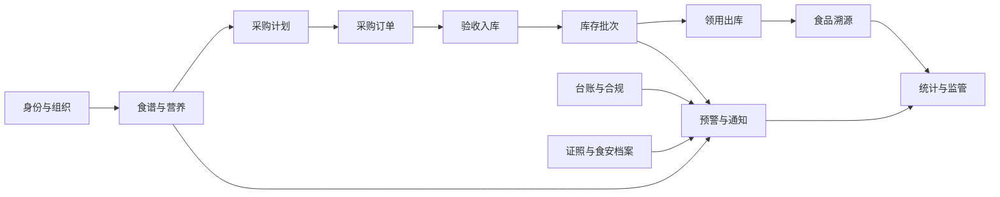

# 阶段 0：统一领域模型

## 领域上下文

## 上下文和聚合

| 上下文 | 聚合根 | 主要对象 | 所有者 |
| --- | --- | --- | --- |
| 身份与组织 | School、Canteen、User | Role、Permission、Staff、Supplier | 平台/学校 |
| 食谱与营养 | Menu、Dish、Ingredient | MenuItem、Recipe、Nutrition、ServingProfile | 食堂 |
| 采购与履约 | ProcurementPlan、PurchaseOrder | PlanItem、OrderItem、Delivery、Inspection、Receipt | 食堂/供应商 |
| 库存 | InventoryBatch、StockOut | BatchSource、StockOutItem、InventoryAdjustment | 食堂 |
| 台账与合规 | LedgerCycle、LedgerRecord | LedgerType、LedgerTemplate、LedgerRequirement、Attachment | 食堂 |
| 预警与通知 | Alert | AlertRule、Notification、Disposal、DisposalAttachment | 食堂/监管 |
| 食品溯源 | TraceabilityRecord | TraceNode、TraceabilityCode、SampleRecord | 食堂 |
| 统计与监管 | RiskAssessment、Rating | ScoreDimension、StatisticSnapshot、InspectionTask | 监管 |
| 外部接入 | IntegrationConnection | SyncRun、Device、RawMessage | 平台 |

## 共享值对象

`CanteenScope` 表示一个运营数据归属边界，由一个学校和该学校下的一个食堂构成。菜单、采购、库存、台账、预警和溯源聚合都必须携带一个有效的 `CanteenScope`；监管查询可以基于多个已授权范围汇总，但不能把多个范围压成一个普通食堂聚合。

约束：

- 学校和食堂标识不能为空，食堂必须属于该学校；
- 聚合之间比较范围时使用 `CanteenScope`，不在各模块分别拼接标识；
- 监管角色的区域范围是授权集合，不等同于绕过单个 `CanteenScope` 校验。

## 关键关系

- 一个 School 拥有一个或多个 Canteen。
- 一个 Canteen 拥有自己的 Menu、Supplier 关系、Inventory、LedgerCycle 和 Alert。
- 一个 Menu 包含多个 MenuItem；每个 MenuItem 引用一个 Dish。
- 一个 Dish 通过 Recipe 引用多个 Ingredient，并按 ServingProfile保存用量。
- 一个 ProcurementPlan 来源于一个或多个已审批 Menu 版本。
- 一个 PurchaseOrder 来源于一个采购计划或线下补录，并包含多个 OrderItem。
- 一个 Receipt 只能验收一个 PurchaseOrder，但一个订单可以分批验收。
- 一个 Receipt 产生一个或多个 InventoryBatch。
- 一个 StockOut 可以消耗多个 InventoryBatch，并必须记录用途和操作人。
- 一个 TraceabilityCode 关联一组出库、批次、采购、验收、供应商和制作/留样节点。
- 一个 Alert 可以来自内部规则或外部适配器，但进入领域后使用同一状态和处置模型。

## 领域不变量

1. 所有运营聚合必须属于一个有效的 Canteen Scope。
2. 已发布 Menu 不可直接修改；修改必须创建新版本或重新进入审批。
3. 采购计划不是采购订单，计划确认前不能产生履约义务。
4. PurchaseOrder 的金额由持久化明细计算，客户端金额只作为展示值。
5. Receipt 的实收数量不能绕过验收直接写入库存。
6. InventoryBatch 的剩余数量不能为负数，出库不足必须整笔回滚。
7. 过期批次不能用于正常出库，报损需要单独的用途和审计记录。
8. 一个 LedgerCycle 中同一个 LedgerRequirement 只能形成一份有效 LedgerRecord。
9. 一个外部事件使用 `source + thirdWarnId` 幂等，内容变化不得覆盖原事件。
10. Alert 关闭必须有处置人、处置时间和处置结果。
11. 统计数据必须能追溯到业务明细或明确标记为快照数据。
12. 外部系统不能直接写入领域数据库，必须经过适配器和归一化校验。
